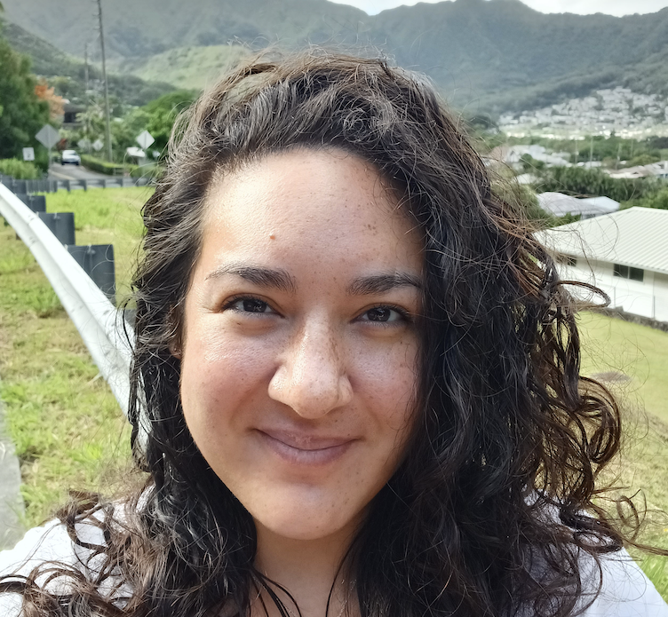

# Learner Corpus Research and Applied Data Science Lab at the University of Oregon

The LCR-ADS lab at the University of Oregon conducts linguistic research related to language development and assessment (primarily with second language users). We develop, test, and implement linguistic analysis methods, collect and annotate corpora, and develop and evaluate language assessment tools (primarily related to language production tasks).

## Grant Funded Projects
(2022-). *Towards an automatic assessment of rhetorical functions in academic English writing.* PI: Masaki Eguchi. Supervisor: Kristopher Kyle. The 2022 Duolingo English Test Doctoral Dissertation Award sponsored by Duolingo.

(2022-). *Automatic assessment of stance-taking in English academic writing: A systemic functional perspective.* PI: Masaki Eguchi. Supervisor: Kristopher Kyle. The TIRF Doctoral Dissertation Grant 2022 sponsored by the International Research Foundation for English Language Education (TIRF).

(2022-). *Automatic analysis of stance-taking in academic writing: A systemic functional perspective.* PI: Masaki Eguchi. Supervisor: Kristopher Kyle. The NFMLTA-MLJ Doctoral Dissertation Writing Support Grant 2022 sponsored by the National Federation of Modern Language Teachers Associations (NFMLTA).

(2020-2021). *The development of lexico-grammatical complexity in two task types: A year-long study.* PI: Masaki Eguchi. Co-PI: Kristopher Kyle. Spaan Research Grant sponsored by Michigan Language Assessment.

(2019-2020). *Evaluating NLP for L2 Research: A gold standard part of speech tagged and dependency parsed corpus of L2 speaking.* PI: Kristopher Kyle. Language Learning Early Career Grant.

(2018-2020). *A linguistic analysis of the communication demands in typical technology-mediated learning environments.* PI: Kristopher Kyle. Co-PIs: Nicole Ziegler & Geoffrey LaFlair. Grant sponsored by TOEFL Committee of Examiners.

## Linguistic Analysis Tools
We develop (often in collaboration with other labs) and maintain a range of linguistic analysis tools.  <a href="https://www.linguisticanalysistools.org/" target="_blank">Click here to learn more</a>
## People
### Director

**<a href="https://kristopherkyle.github.io/professional-webpage/" target="_blank">Kristopher Kyle</a>** (Associate Professor, Linguistics Department)  

### Graduate Student Researchers

**<a href="https://www.carlaconsolini.com/" target="_blank">Carla H. Consolini</a>** (PhD Student, Linguistics, Fall 2019-)

**<a href="https://hksung.github.io/" target="_blank">Hakyung Sung</a>** (PhD Student, Linguistics, Fall 2021-)

### Visiting Scholars
**Hong Shinchul** (Professor at Busan University of Foreign Studies, Spring 2023-)  

### Previous Graduate Students
  

**<a href="https://masakieguchi.weebly.com/about-me.html" target="_blank">Masaki Eguchi</a>** (PhD Student, Linguistics, Fall 2018-2023) 
Research Assistant Professor at Waseda University

### Undergraduate Student Researchers:
**Bella Graham** (Annotator, Summer23-)  
**Marianne Hatley** (Annotator, Summer23-)  
**Holly Renshaw** (Annotator, Spring23-)  
**Ryan Walker** (Annotator, Winter23-)  

### Previous Student Researchers:
**Sabine Ricioppo** (Visiting PhD Student, Fall 2019-Summer 2020)  
**María Adsuara Martínez** (Visiting PhD Student, Summer 2023)  
**Chasen Afghani** (Annotator, Winter-Summer 2019)  
**Charles Baker-Rozell** (Annotator, Spring 2021)  
**Tyler Demmon** (Annotator, Spring 2021)  
**Hana Dussan** (Annotator, Summer 2023)  
**Zoe Haupt** (Annotator, Spring 2021)  
**Stacia Henry** (Transcriber, Winter 2019)  
**Reed Jordan** (Annotator, Winter-Summer 2019)  
**Yancee Larson** (Transcriber, Winter-Summer 2019)  
**<a href="https:https://amille929.github.io" target="_blank">Aaron Miller** (Annotator, Spring21-Winter23)  
**Lilly Pool** (Transcriber, Winter-Summer 2019)  
**Ted Sither** (Annotator, Winter 2019-Spring 2022)  
**Grace Teuscher** (Annotator, Winter-Summer 2019)  
**Claire Worthington** (Annotator, Spring 2021)  
