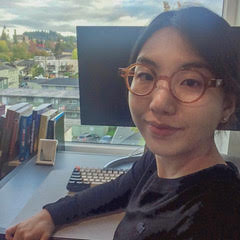

# Learner Corpus Research and Applied Data Science Lab at the University of Oregon

The LCR-ADS lab at the University of Oregon conducts linguistic research related to language development and assessment (primarily with second language users). We develop, test, and implement linguistic analysis methods, collect and annotate corpora, and develop and evaluate language assessment tools (primarily related to language production tasks).

## Grant Funded Projects
(2020-2021). *The development of lexico-grammatical complexity in two task types: A year-long study.* PI: Masaki Eguchi. Co-PI: Kristopher Kyle. Spaan Research Grant sponsored by Michigan Language Assessment.

(2019-2020). *Evaluating NLP for L2 Research: A gold standard part of speech tagged and dependency parsed corpus of L2 speaking.* PI: Kristopher Kyle. Language Learning Early Career Grant.

(2018-2020). *A linguistic analysis of the communication demands in typical technology-mediated learning environments.* PI: Kristopher Kyle. Co-PIs: Nicole Ziegler & Geoffrey LaFlair. Grant sponsored by TOEFL Committee of Examiners.

## Linguistic Analysis Tools
We develop (often in collaboration with other labs) and maintain a range of linguistic analysis tools.   
[Click here to learn more](https://www.linguisticanalysistools.org/)

## People
### Director

**<a href = "https://kristopherkyle.github.io/professional-webpage/" target="_blank">Kristopher Kyle</a>** (Assistant Professor, Linguistics Department)  

### Graduate Student Researchers
**Masaki Eguchi** (PhD Student, Linguistics, Fall 2017-)  

**Hakyung Sung** (PhD Student, Linguistics, Fall 2021-)

### Undergraduate Student Researchers
**Tyler Demmon** (Annotator, Spring 2021-)  
**Zoe Haupt** (Annotator, Spring 2021-)  
**Aaron Miller** (Annotator, Spring 2021-)  
**Ted Sither** (Annotator, Winter 2019- )  
**Claire Worthington** (Annotator, Spring 2021-)  

### Previous Student Researchers:
**Sabine Ricioppo** (Visiting PhD Student, Fall 2019-Summer 2020)  
**Chasen Afghani** (Annotator, Winter-Summer 2019)    
**Charles Baker-Rozell** (Annotator, Spring 2021)  
**Stacia Henry** (Transcriber, Winter 2019)
**Reed Jordan** (Annotator, Winter-Summer 2019)  
**Yancee Larson** (Transcriber, Winter-Summer 2019)   
**Lilly Pool** (Transcriber, Winter-Summer 2019)  
**Grace Teuscher** (Annotator, Winter-Summer 2019)
