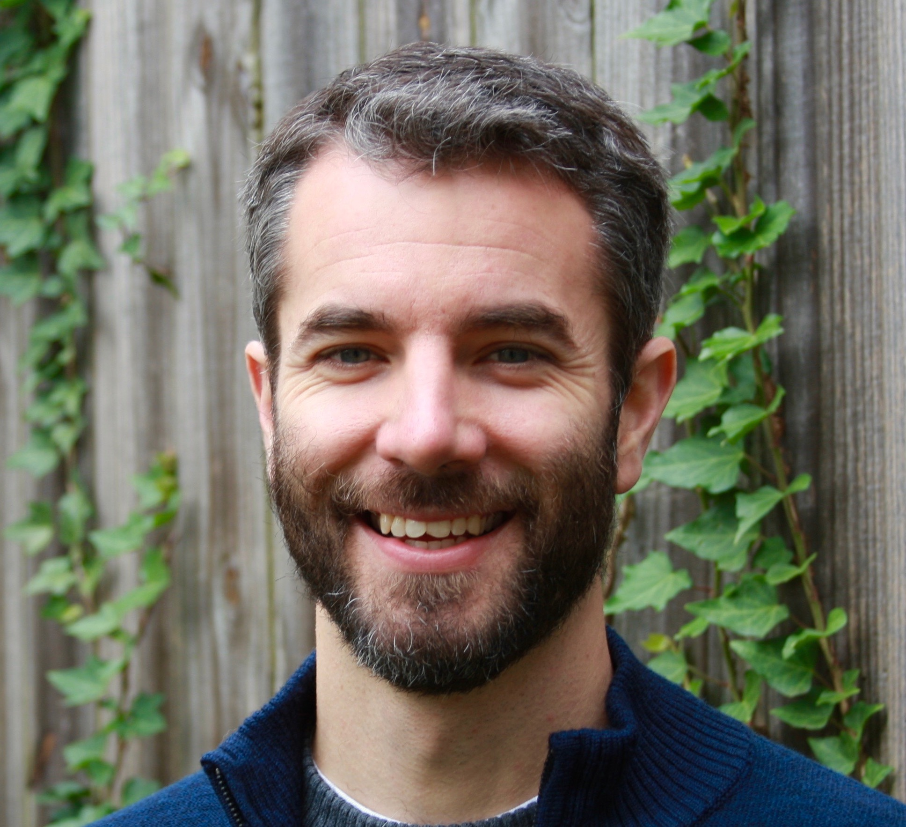
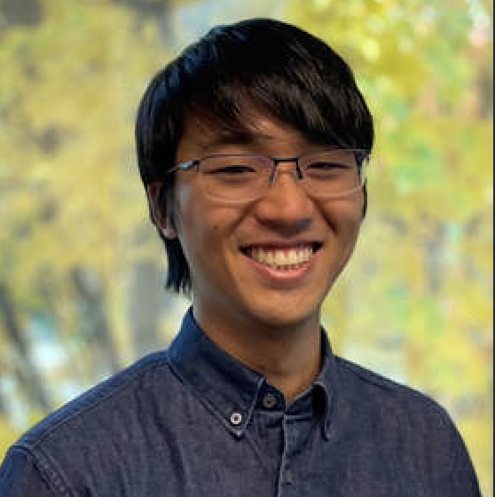
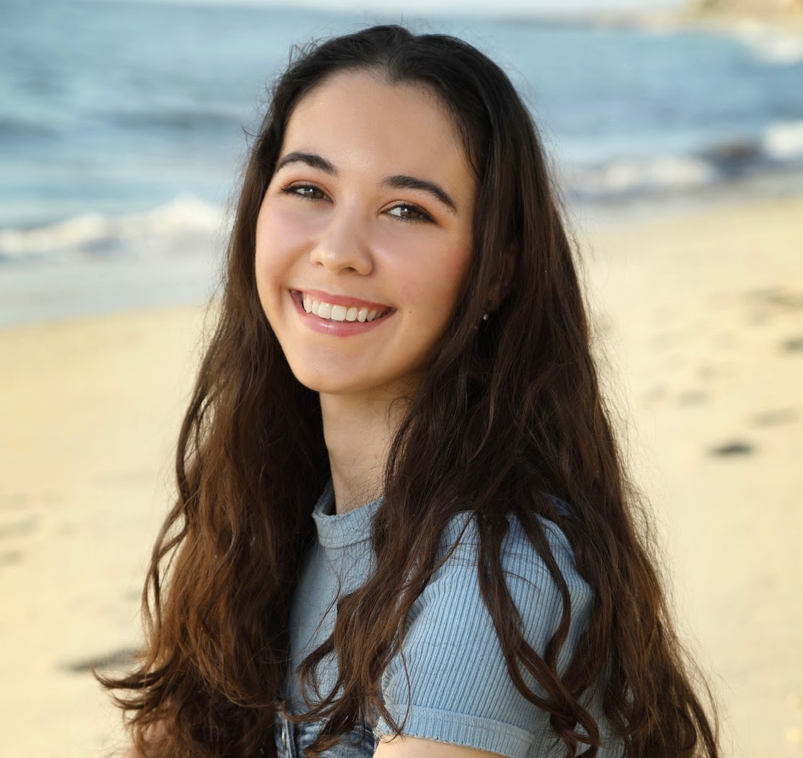

### Director

  

    
  

  

    <a href="https://kristopherkyle.github.io/professional-webpage/" target="_blank">
      <strong>Kristopher Kyle</strong>
    </a> (Associate Professor, Linguistics Department)
  

### Graduate Student Researchers

  

    <a href="https://masakieguchi.weebly.com/about-me.html" target="_blank">
      

        
      

     
    <strong>Masaki Eguchi</strong>
     
    </a>
    (PhD Student, Linguistics, Fall 18-)
  

  

    <a href="https://hksung.github.io/" target="_blank">
      

        
      

     
    <strong>Hakyung Sung</strong>
     
    </a>      
    (PhD Student, Linguistics, Fall 21-)
  

  

    <h3>Undergraduate Student Researchers</h3>
    

      

        
      

      

        <strong>Augustus Paddock</strong> 
        (Annotator, S23-)
      

    

    

      

        
      

      

        <strong>Holly Renshaw</strong> 
        (Annotator, S23-)
      

    

    

      

        
      

      

        <strong>Ryan Walker</strong> 
        (Annotator, W23-)
      

    

  

   

     <h3>Previous Student Researchers</h3>
     

      <strong>Sabine Ricioppo</strong> 
      (Visiting PhD Std., F19-S20) 
      <strong>Chasen Afghani</strong> 
      (Annotator, W-S19) 
      <strong>Charles Baker-Rozell</strong> 
      (Annotator, S21) 
      <strong>Tyler Demmon</strong> 
      (Annotator, S21) 
      <strong>Zoe Haupt</strong> 
      (Annotator, S21) 
      <strong>Stacia Henry</strong> 
      (Transcriber, W19) 
      <strong>Reed Jordan</strong> 
      (Annotator, W-S19) 
      <strong>Yancee Larson</strong> 
      (Transcriber, W-S19) 
      <strong>Aaron Miller</strong> 
      (Annotator, S21-W23) 
      <strong>Lilly Pool</strong> 
      (Transcriber, W-S19) 
      <strong>Ted Sither</strong> 
      (Annotator, W19-S22) 
      <strong>Grace Teuscher</strong>  
      (Annotator, W-S19) 
      <strong>Claire Worthington</strong>  
      (Annotator, S21) 
       
    

  

